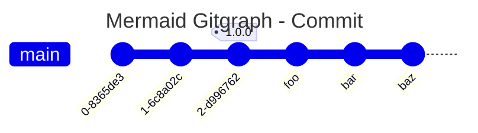
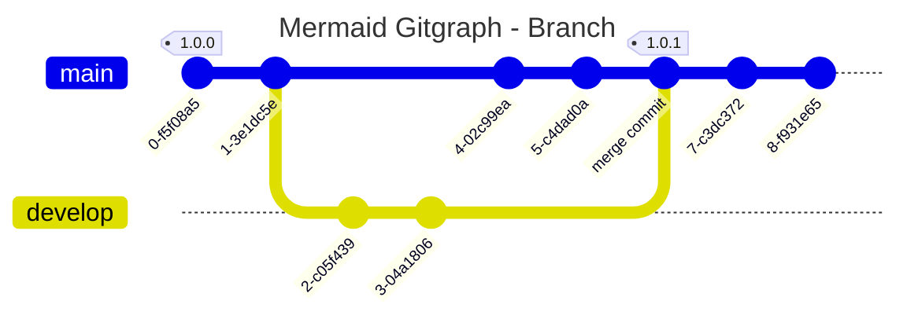

# Mermaid Gitgraph
{:.no_toc}

* toc
{:toc}

## ドキュメント
- [Gitgraph Diagrams](https://mermaid.js.org/syntax/gitgraph.html){:target="_blank"}

## 使い方

### コミット

```mermaid
---
title: Mermaid Gitgraph - Commit
---
gitGraph
   %% コミットIDは自動で採番される。
   commit
   commit
   %% タグを指定する。
   commit tag: "1.0.0"
   %% コミットIDを指定することもできる。
   commit id: "foo"
   commit id: "bar"
   commit id: "baz"
```

### ブランチ

```mermaid
---
title: Mermaid Gitgraph - Branch
---
gitGraph
   commit tag: "1.0.0"
   commit
   %% 新規ブランチを作成する。
   branch develop
   %% 以降のコミットは新規ブランチに積み上げられる。
   commit
   commit
   %% 既存ブランチにチェックアウトする。
   checkout main
   %% 以降のコミットは既存ブランチに積み上げられる。
   commit
   commit
   %% チェックアウト中のブランチに指定のブランチをマージする。
   merge develop id: "merge commit" type: NORMAL tag: "1.0.1"
   commit
   commit
```

