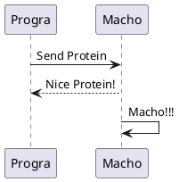
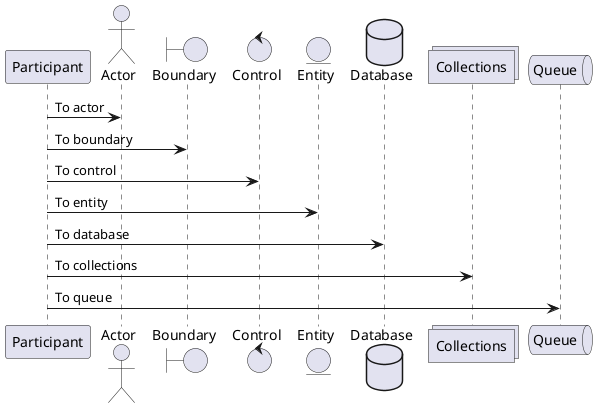
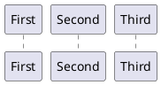
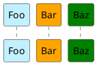
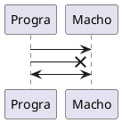
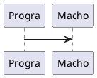

# PlantUML
{:.no_toc}

* toc
{:toc}

## ドキュメント
- [PlantUML 概要](https://plantuml.com/en/){:target="_blank"} ([日本語版](https://plantuml.com/ja/){:target="_blank"})
- [PlantUML Web Server](http://www.plantuml.com/plantuml/uml/){:target="_blank"}

## セットアップ
```
# Mac
brew install plantuml

# Windows
scoop install plantuml
```

## 使い方
```shell
plantuml programacho.plantuml

# Windows環境では文字コードを指定しないと文字化けする。
plantuml programacho.plantuml -charset UTF-8

ls
programacho.plantuml	programacho.png
```

## シーケンス図

### 基本


### オブジェクトの種類


### オブジェクトの順序


### オブジェクトの色
- [色の選択 \| PlantUML](https://plantuml.com/en/color){:target="_blank"} ([日本語版](https://plantuml.com/ja/color){:target="_blank"})



### 矢印の種類


### コメントの種類

